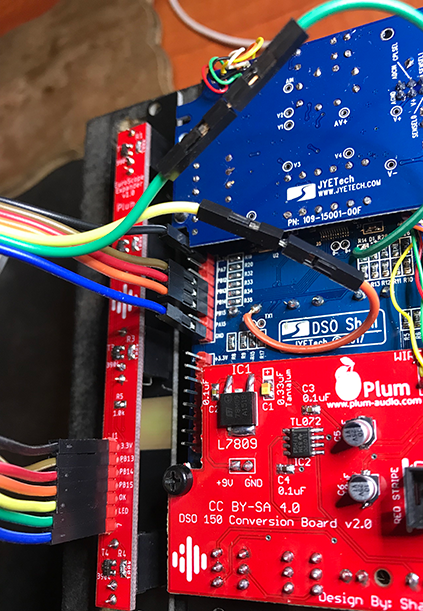
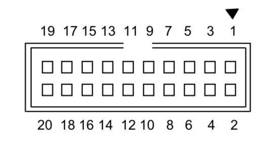
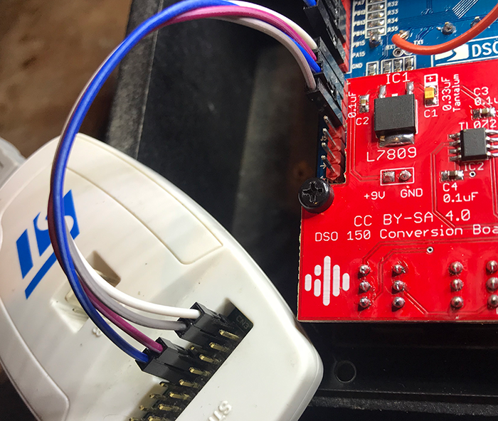

**Expander For EuroScope**

Adds additional Buffered inputs:
- 3 Digital Inputs D1, D2, D3 (OPEN DSO 150 Firmware is required).
- OK button trigger input.
- Also, brings the DSO150 Trigger led indicator to front.

**BOM:**

|Q|Part|Value|Reference|
|-|----|-----|---------|
|1|Assembled EuroScope|Expander will work with all versions|[Pusherman](https://pushermanproductions.com/product/dso150-mk2-oscilloscope-eurorack-conversion-kit-14hp-pcb-panel/)|
|1|Expander PCB&Panel||[Pusherman](https://pushermanproductions.com/product/plum-audio-dso150-mk2-oscilloscope-expander-2hp-pcb-panel/)|
|4|Resistor 0603|100k|R1, R2, R3, R4|
|1|Resistor 0603|1K|R5 (For Led Brightness)|
|4|NPN Transistor| MMBT3904|T1, T2, T3, T4|
|1|LED 1206|Any colour you like...|LED1|
|4|Jack PJ398SM|"Thonkiconn"|J2, J3, J4, J5|
|1|Male Pin headers 2.54| 1 row of 7 Pins| J1|
|1|Male Pin headers 2.54| 1 row of 8 Pins|**DSO150 Main Board:** J9 (For Connection with Expander)|
|1|Male Pin headers 2.54| 1 row of 4 Pins|**DSO150 Main Board:** J3 (SWD - To Update the Firmware)
|7|Feamle to Feamle Jumper Wire|To connect between Boards||
|1|Male to Male Jumper Wire|To connect between Boards|| 

**How To Build?**
1. Build the Expander... Solder all components in place and assemble the panel.
2. Connect the Expander:

|Expander J1|DSO 150|
|-----------|-------|
|3.3V|3.3V @J9|
|PB13|PB13 @J9|
|PB14|PB14 @J9|
|PB15|PB15 @J9|
|GND|GND @J9|

Cut Male to Male Jumper wire into two parts and solder to DSO150:

|Expander J1|DSO 150|
|-----------|-------|
|OK|Top Right Pin of OK Button|
|LED|Remove R14 and solder this wire to top pad of R14|

___________________________________________________________________________S
**Firmware Update:**

I'm using ST-LINK V2 with ST-LINK Utility software on Windows Environment.
You can find hex file on this repo ([here](Firmware%20-%20Open%20DSO150)) 

Connect the programer to DSO150:

|ST-LINK JTAG Port|DSO 150|
|-----------------|-------|
|Pin 1|3.3V @J3|
|Pin 3|GND @J3|
|Pin 7|DIO @J3|
|Pin 9|CLK @J3|

**With ST-LINK Utility Software:**
* Connect your EuroScope to power source.
1. Go to Target->Settings and choose SWD Port, Frequency = 4.0 MHz, After you click "OK" the programer should connect to DSO150 automatically.
2. Go to Target->Program & Veify, Browse and select new firmware hex file and hit Start
3. After the Flash process finished, restart EuroScope and hold "OK" button during boot up.

