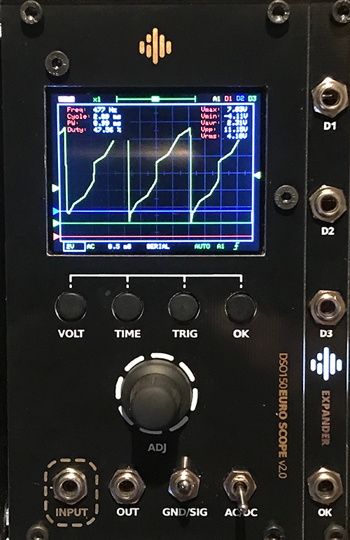

# EuroScope MKII - DSO150 Eurorack Conversion Kit

[DSO 150](https://www.banggood.com/Orignal-JYE-Tech-DS0150-15001K-DSO-SHELL-DIY-Digital-Oscilloscope-Kit-With-Housing-p-1093865.html?p=PN14171629793201505V&cur_warehouse=CN) Is a cheap mini oscilloscope from JYE TECH.

This conversion kit lets you the ability to convert it to Eruorack module and contains two parts:

* 14 Hp Panel
* Conversion Board
* Optional: Expander 2Hp PCB+Panel

This is an easy DIY project, just follow the [Build guide](EuroScope_mk2-Build_Guide.pdf).

* Assemblong Videos Playlist: https://www.youtube.com/watch?v=Akz4jSZyOQc&list=PL2KBIbSMnGOh_Mu7Z_c3bYFIhDCGHZpcL

___________________________________________________
## Alternative Firmware:
There is alternative firmware to DSO150 that add lots of new features, more info at:
[Open DSO 150](https://github.com/michar71/Open-DSO-150)
___________________________________________________
## Which is the right DSO150 DIY Kit?
I checked few sources for the DSO150 kits, only the ones that come from [Banggood](https://www.banggood.com/Orignal-JYE-Tech-DS0150-15001K-DSO-SHELL-DIY-Digital-Oscilloscope-Kit-With-Housing-p-1093865.html?p=PN14171629793201505V&cur_warehouse=CN) was original 2017 version.

Other versions was less accurate and with a lots of ground noises.
If you’re not buying the banggood version you need to find 2017 version and pay attention to (see picture):
1. Trimmers location.
2. Cut in the main PCB for trimmers access.
3. Only 3 electrolytic capacitors in the analog board (not 5).
4. Sticker with Serial Number.
5. Silk screen that says it’s 2017 version... 

